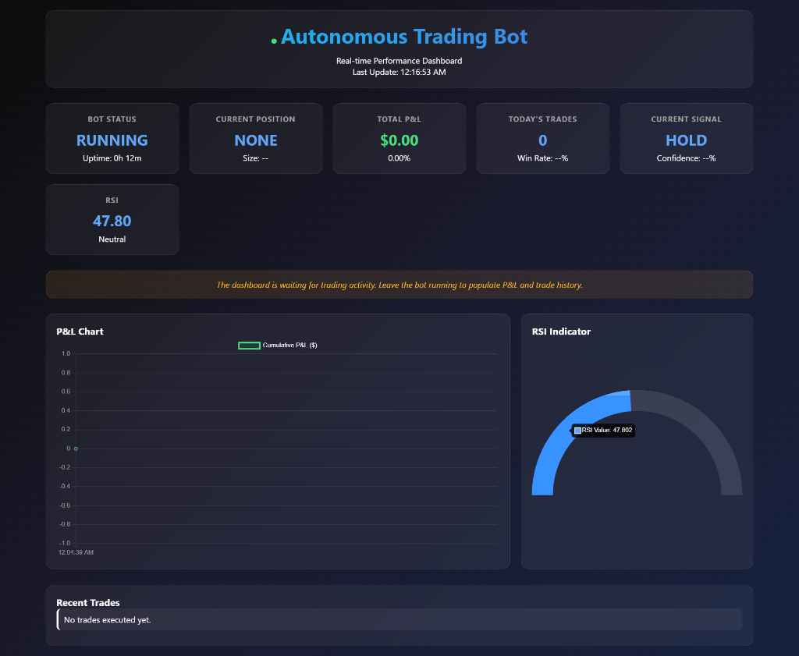

# 🚀 Advanced Autonomous Trading Bot

[](https://www.python.org/)
[](https://binance.com)
[](#strategies)
[](#dashboard)
[](LICENSE)

A **professional-grade, autonomous cryptocurrency trading bot** featuring advanced risk management, multi-strategy ensemble decisions, real-time monitoring dashboard, and comprehensive position tracking. Built for the Binance Futures Testnet with production-ready architecture.



## 🎯 Project Overview

This project evolved from a basic CLI trading bot into a **sophisticated algorithmic trading system** that demonstrates:

- **Domain Expertise**: Deep understanding of cryptocurrency trading mechanics, technical analysis, and risk management
- **Software Engineering Excellence**: Clean architecture, design patterns, separation of concerns, and production-ready code quality
- **Full-Stack Development**: Backend trading engine with real-time web dashboard using Flask and Socket.IO
- **Financial Technology**: Implementation of professional trading concepts like position sizing, stop-loss/take-profit, and multi-strategy ensemble voting

> **Originally built as a skills assessment for a Junior Python Developer role**, this project significantly exceeds typical junior-level expectations by incorporating advanced trading concepts and professional software development practices.

## ✨ Key Features

### 🧠 **Intelligent Trading Engine**

- **Multi-Strategy Framework**: RSI and MACD strategies with ensemble decision-making
- **Weighted Confidence Voting**: Strategies contribute based on signal strength and historical performance
- **Adaptive Signal Filtering**: Minimum confidence thresholds prevent weak signal execution

### 🛡️ **Advanced Risk Management**

- **Dynamic Position Sizing**: Account balance-based position calculations
- **Stop-Loss & Take-Profit**: Automatic exit triggers with customizable percentages
- **Daily Loss Limits**: Circuit breaker functionality to prevent catastrophic losses
- **Real-time Risk Monitoring**: Continuous position evaluation and exposure tracking

### 📊 **Professional Position Management**

- **Granular Trade Tracking**: Entry/exit prices, P&L calculation, duration analysis
- **Complete Trade History**: Audit trail of all executed trades with performance metrics
- **Unrealized P&L Monitoring**: Live position valuation and portfolio performance

### 🌐 **Real-Time Dashboard**

- **Live Performance Metrics**: P&L charts, win rate, and strategy confidence scores
- **Position Visualization**: Current holdings, risk exposure, and trade history
- **Socket.IO Integration**: Real-time data streaming without page refreshes
- **Responsive Design**: Professional UI with interactive charts and alerts

### 🔧 **Production-Ready Infrastructure**

- **Environment-Based Configuration**: Secure API key management via `.env` files
- **Comprehensive Logging**: Structured logging with rotation and multiple output formats
- **Graceful Error Handling**: Robust exception management with automatic recovery
- **Multi-Threading Architecture**: Parallel execution of trading logic and web server

## 🏗️ Architecture

```
├── bot.py                  # Core trading logic and Binance API integration
├── main.py                 # Main execution engine with multi-threading
├── app.py                  # Flask web server for dashboard
├── config.py               # Environment-based configuration management
├── management/             # Advanced trading management systems
│   ├── position_manager.py # Position tracking and P&L calculation
│   └── risk_manager.py     # Risk controls and position sizing
├── strategies/             # Modular trading strategy framework
│   ├── base_strategy.py    # Abstract strategy interface
│   ├── rsi_strategy.py     # RSI-based trading signals
│   ├── macd_strategy.py    # MACD crossover strategy
│   └── ensemble_strategy.py # Multi-strategy ensemble voting
├── templates/              # Web dashboard templates
│   └── dashboard.html      # Real-time monitoring interface
├── static/                 # Dashboard assets (CSS, JS)
└── requirements.txt        # Project dependencies
```

## 🚀 Quick Start

### Prerequisites

- Python 3.8+
- Binance Testnet Account
- Basic understanding of cryptocurrency trading concepts

### Installation

1. **Clone the Repository**

   ```bash
   git clone https://github.com/sahxil/python-trading-bot.git
   cd python-trading-bot
   ```

2. **Set Up Virtual Environment**

   ```bash
   python -m venv .venv
   source .venv/bin/activate  # On Windows: .venv\Scripts\activate
   ```

3. **Install Dependencies**

   ```bash
   pip install -r requirements.txt
   ```

4. **Configure Environment Variables**

   Create a `.env` file in the project root:

   ```env
   # Binance Testnet API Credentials
   BINANCE_API_KEY=your_testnet_api_key_here
   BINANCE_API_SECRET=your_testnet_api_secret_here

   # Trading Parameters
   TRADING_SYMBOL=BTCUSDT
   TRADING_QUANTITY=0.001
   TRADING_INTERVAL=1m
   SLEEP_INTERVAL=60

   # RSI Strategy Settings
   RSI_PERIOD=14
   RSI_OVERBOUGHT=70
   RSI_OVERSOLD=30

   # Risk Management
   MAX_POSITION_SIZE_PCT=2.0
   STOP_LOSS_PCT=1.0
   TAKE_PROFIT_PCT=2.0
   MAX_DAILY_LOSS_PCT=5.0

   # Dashboard Settings
   FLASK_PORT=5000
   ```

5. **Get Binance Testnet API Keys**
   - Visit [Binance Testnet](https://testnet.binancefuture.com/)
   - Create an account and generate API keys
   - Add the keys to your `.env` file

### Running the Bot

```bash
# Start the complete system (trading bot + dashboard)
python main.py

# Access the dashboard at: http://localhost:5000
```

The bot will:

1. Initialize the trading engine and risk management systems
2. Start the Flask web server for the dashboard
3. Begin autonomous trading based on the configured strategies
4. Stream real-time updates to the web interface

## 📈 Trading Strategies

### RSI Strategy

**Relative Strength Index momentum strategy**

- **Buy Signal**: RSI drops below 30 (oversold condition)
- **Sell Signal**: RSI rises above 70 (overbought condition)
- **Confidence Scoring**: Based on distance from neutral (50)

### MACD Strategy

**Moving Average Convergence Divergence crossover strategy**

- **Buy Signal**: MACD line crosses above signal line (bullish crossover)
- **Sell Signal**: MACD line crosses below signal line (bearish crossover)
- **Confidence Scoring**: Based on distance between MACD and signal lines

### Ensemble Decision Engine

**Intelligent combination of multiple strategies**

- **Weighted Voting**: Each strategy contributes based on historical performance
- **Confidence Filtering**: Minimum threshold requirements prevent weak signals
- **Dynamic Adjustment**: Strategy weights adapt based on recent performance

```python
# Example: Strategy breakdown for a trading decision
{
    'final_signal': 'BUY',
    'total_confidence': 0.75,
    'strategy_breakdown': {
        'RSI': {'signal': 'BUY', 'confidence': 0.8, 'weight': 0.6},
        'MACD': {'signal': 'HOLD', 'confidence': 0.3, 'weight': 0.4}
    }
}
```

## 🛡️ Risk Management

### Position Sizing

- **Account-Based Calculation**: Position size as percentage of total balance
- **Dynamic Adjustment**: Automatically adjusts to account growth/decline
- **Maximum Exposure**: Configurable limits to prevent overexposure

### Stop-Loss & Take-Profit

- **Automatic Triggers**: Continuous monitoring of open positions
- **Percentage-Based**: Configurable stop-loss and take-profit levels
- **Immediate Execution**: Market orders for rapid position closure

### Daily Circuit Breakers

- **Loss Limits**: Automatic trading halt if daily loss threshold reached
- **Trade Frequency Controls**: Prevent overtrading in volatile conditions
- **Cool-down Periods**: Mandatory waiting periods after significant losses

## 📊 Dashboard Features

### Real-Time Monitoring

- **Live P&L Tracking**: Continuous portfolio valuation updates
- **Position Status**: Current holdings, entry prices, and unrealized gains
- **Strategy Signals**: Real-time display of strategy recommendations

### Performance Analytics

- **Trade History**: Complete log of executed trades with performance metrics
- **Win Rate Calculation**: Success rate and average profit/loss per trade
- **Risk Metrics**: Current exposure, daily P&L, and risk-adjusted returns

### Interactive Charts

- **P&L Visualization**: Historical performance with trend analysis
- **Technical Indicators**: RSI levels, MACD signals, and price action
- **Signal Confidence**: Strategy strength and ensemble voting breakdown

## 🔧 Configuration Options

### Trading Parameters

```env
TRADING_SYMBOL=BTCUSDT          # Trading pair
TRADING_QUANTITY=0.001          # Base trade size
TRADING_INTERVAL=1m             # Chart timeframe
SLEEP_INTERVAL=60               # Loop delay (seconds)
```

### Strategy Settings

```env
RSI_PERIOD=14                   # RSI calculation period
RSI_OVERBOUGHT=70               # Sell threshold
RSI_OVERSOLD=30                 # Buy threshold
```

### Risk Controls

```env
MAX_POSITION_SIZE_PCT=2.0       # Max position as % of balance
STOP_LOSS_PCT=1.0               # Stop-loss trigger
TAKE_PROFIT_PCT=2.0             # Take-profit trigger
MAX_DAILY_LOSS_PCT=5.0          # Daily loss circuit breaker
```

## 📝 Logging & Monitoring

### Comprehensive Logging

- **Structured Logs**: JSON format for easy parsing and analysis
- **Multiple Outputs**: Console display and persistent file storage
- **Log Rotation**: Automatic cleanup to prevent disk space issues
- **Severity Levels**: DEBUG, INFO, WARNING, ERROR, CRITICAL

### Log Examples

```
2024-01-15 14:32:18 - INFO - Ensemble Analysis: BUY | Confidence: 0.75
2024-01-15 14:32:18 - INFO - RSI: BUY (conf: 0.80)
2024-01-15 14:32:18 - INFO - MACD: HOLD (conf: 0.30)
2024-01-15 14:32:19 - INFO - Position opened: LONG 0.001 BTCUSDT at 59842.50
2024-01-15 14:45:32 - INFO - Position closed. Realized P&L: +12.45 USDT
```

## 🧪 Development & Testing

### Code Quality

- **Type Hints**: Full type annotation for better IDE support and error detection
- **Docstrings**: Comprehensive documentation for all classes and methods
- **Error Handling**: Graceful handling of API failures and network issues
- **Clean Architecture**: Separation of concerns with modular design

### Testing Strategy

```bash
# Run the bot in paper trading mode (testnet)
python main.py --testnet

# Monitor logs for strategy performance
tail -f trading_bot.log

# Test individual strategies
python -c "from strategies.rsi_strategy import RSIStrategy; print('RSI Strategy loaded successfully')"
```

## 🎯 Technical Highlights

### Advanced Python Concepts

- **Abstract Base Classes**: Extensible strategy framework
- **Dataclasses**: Clean data modeling for trades and positions
- **Context Managers**: Proper resource management for API connections
- **Multi-threading**: Concurrent execution of trading and web serving
- **Environment Variables**: Secure configuration management

### Financial Technology Implementation

- **Real-time Data Processing**: Efficient handling of streaming market data
- **Risk-Adjusted Position Sizing**: Kelly criterion and portfolio theory concepts
- **Technical Analysis**: Professional implementation of trading indicators
- **Order Management**: Proper handling of partial fills and slippage

### Web Development Skills

- **Flask Framework**: RESTful API design and template rendering
- **Socket.IO**: Real-time bidirectional communication
- **Responsive Design**: Mobile-friendly dashboard interface
- **JavaScript Integration**: Dynamic updates and interactive charts

## 📚 Educational Value

This project demonstrates proficiency in:

### **Backend Development**

- RESTful API design with Flask
- Database-free state management
- Real-time data streaming with WebSockets
- Multi-threaded application architecture

### **Financial Technology**

- Cryptocurrency trading concepts
- Risk management implementation
- Technical analysis and algorithmic trading
- Portfolio management and position tracking

### **Software Engineering**

- Clean code principles and design patterns
- Error handling and logging best practices
- Configuration management and environment variables
- Modular architecture with separation of concerns

### **DevOps & Deployment**

- Virtual environment management
- Dependency management with requirements.txt
- Environment-based configuration
- Production-ready logging and monitoring

## 🚀 Future Enhancements

### Potential Additions

- **Machine Learning Integration**: Predictive models for signal enhancement
- **Multiple Exchange Support**: Binance, Coinbase Pro, Kraken integration
- **Advanced Order Types**: Iceberg orders, TWAP, and algorithmic execution
- **Backtesting Framework**: Historical strategy validation and optimization
- **Mobile Application**: React Native or Flutter mobile dashboard
- **Database Integration**: PostgreSQL for trade history and analytics

### Scalability Considerations

- **Microservices Architecture**: Separate services for different functions
- **Message Queue Integration**: Redis or RabbitMQ for event handling
- **Container Deployment**: Docker containerization for easy deployment
- **Cloud Integration**: AWS/GCP deployment with managed databases

## 📄 License

This project is licensed under the MIT License - see the [LICENSE](LICENSE) file for details.

## 🤝 Contributing

Contributions are welcome! Please feel free to submit a Pull Request. For major changes, please open an issue first to discuss what you would like to change.

### Development Guidelines

1. Follow PEP 8 style guidelines
2. Add type hints to all functions
3. Include comprehensive docstrings
4. Test all changes thoroughly on testnet
5. Update documentation as needed

## ⚠️ Disclaimer

This software is for educational and testing purposes only. Cryptocurrency trading involves substantial risk of loss and is not suitable for all investors. The use of this software is at your own risk, and the developers assume no responsibility for any financial losses incurred.

**Always test thoroughly on testnet before considering any live trading implementation.**

## 🙋‍♂️ Author

**Sahil** - [GitHub Profile](https://github.com/sahxil)

_Built as a demonstration of advanced Python development skills, domain expertise in cryptocurrency trading, and professional software engineering practices._

---

⭐ **If you found this project helpful, please consider giving it a star!** ⭐
